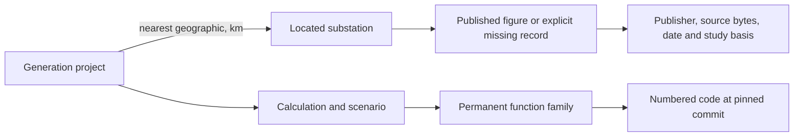

# Spider energy transition protocol — 0.1 draft

The objective is a common, read-only way to trace an electrical-system claim through its assets, scenario, inputs, calculations, permanent code keys and evidence. This draft is a small executable starting point, not an adopted industry standard or a validated power-system model.

## One identity across several views

Map, single-line diagram, Spider, table and generator must refer to the same objects. Existing Stars family and line numbers remain permanent: `family:N`, `line:N`. `block:Sym` links the code organization. Physical assets have separate namespaces; an electrical substation is never a code block simply because both have the same display label. Source-issued identifiers, including CIM identities where supplied, need an explicit crosswalk to estate identities. A label, coordinate or array position is not an identity.

Keep identities stable across snapshots; attach version and content hash to observations and representations. Never renumber a family to compact a file, recycle a retired key, or infer a family key from an electron/soul number. Allocation remains in the existing Stars registry; the adapter only reads keys. Identity immutability across time requires comparing registry snapshots, beyond this validator's within-graph uniqueness checks.

## The first useful journey

This fits the existing grid-graph work order. Start with published project and substation snapshots, exhaustive geographic nearest search, a named Earth radius and pinned algorithm, then a published figure or its absence. Proximity establishes neither network connectivity nor connection capacity. Existing headroom and fault-level contracts remain published-only. Future modelled results belong in explicitly separate records with scenario, method, inputs and validation evidence; this draft does not calculate them.

## Protocol layers

| Layer | Identity and record | What the reader can establish |
|---|---|---|
| Physical system | project, equipment, substation, terminal | source identity, location and documented connectivity |
| Scenario | dated model version, topology state and assumptions | which system state a result describes |
| Quantity | metric, value, unit, status, study basis | measured, published, modelled, missing or fixture |
| Computation | calculation, input digest, algorithm commit | a reproducible calculation recipe |
| Code | block, family and permanent line keys | exactly which implementation supplies a calculation |
| Evidence | dataset, test, published figure or decision | what supports a claim and what remains unresolved |

Detailed time-series, uncertainty, electrical topology, protection and scenario schemas remain to be designed. The small validator implements only the draft boundaries visible in validate.mjs; it does not establish electrical correctness, truthful provenance, universal unit compatibility or complete standards conformance.

## Integration with existing code

`spider-adapter.mjs` projects validated nodes and edges into the existing `{nodes, edges}` shape without changing their IDs. Typed edges retain their metadata. New relationship styles still require receiver support and browser review; passing these tests does not prove that the current dashboard renders every type correctly.

The next Stars builder should emit block → family → line child files using `child_path`, plus a complete reverse line-to-family index. Keep large child collections paged and publish a manifest containing generation, source commits, hashes, counts and completeness. A partial loaded-bucket search must remain labelled partial. Index every family membership, not just the first.

The generator should consume a versioned selection manifest containing existing block/family IDs, source registry snapshot and decisions. Generation happens through its existing workflow or terminal. A selection link from Spider may open the generator, but no build, edit, merge or control command runs inside Spider. The present picker does not yet implement the proposed selection-link contract.

A test-to-family index needs actual execution instrumentation. A green composition test is not evidence that every function in its loaded cartridge ran. An exception-string match is a candidate throw site, not a verified runtime trace. Source places are code occurrences, not proof of deployment.

## Interoperability targets

- IEC 61970 CIM models utility objects and their relationships: [IEC 61970-301 description](https://webstore.iec.ch/en/publication/62698).
- IEC 61968 supplies distribution-oriented integration and CIM extensions: [IEC 61968-11 description](https://webstore.iec.ch/en/publication/6199).
- IEC 61850 addresses utility automation interoperability and information models: [IEC overview](https://iec61850.dvl.iec.ch/), [DER information models](https://webstore.iec.ch/en/publication/34384).

These are authoritative descriptions consulted on 14 September 2026, not a claim that full normative specifications were implemented. Define an explicit mapping profile, supported version and conformance fixtures for each adapter. Preserve source identifiers and record unmapped fields. Unknown mappings fail the relevant profile instead of silently dropping equipment or units.

Becoming a standard requires a published specification, independently implemented adapters, public conformance fixtures, stable versioning and migration rules, and evidence from multiple real networks. GLOBALGRID2050 can be the reference implementation and first proving ground. It cannot confer industry adoption on itself.

## Run the current proof

With Node 24: `node --test protocol/spider-energy/validate.test.mjs` from the repository root. No dependencies are required. Eleven tests cover graph integrity, permanent-key separation, missing quantities, provenance requirements, geographic-versus-electrical semantics and projection identity. The fixture is explicitly synthetic and contains no real asset measurement. Chrome layout, touch and real data integration remain untested.
